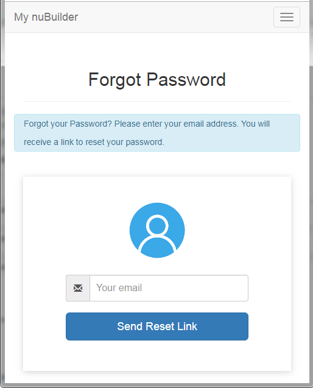

# nuBuilder 4 - Self-Service Password Reset 

## What is it and how does it work?

This self-service Password Reset process enables a user to reset the password without assistance of the nuBuilder administrator (globeadmin).
After the user clicks the "Forgot Password?" on the login page, the "Forgot Password" page will appear and the user is then asked for the email address that is associated with the nuBuilder account. 
If correct, an email is sent to the user with a unique link. The link is valid for a period that you specify and will take the user to a reset password page where a new password can be entered.

<p align="center">
  
</p>

## Setting up the script

1) We need a dedicated table in our database to store the access code. 
That table also stores its expiration date, (nuBuilder) user id, email address and usage date.
In this way we also see who requested a new password, when and if it has been used.
Create a new table "password_request" (by running the sql below in phpMyAdmin).

```mysql
CREATE TABLE `password_request` (
  `password_request_id` int(10) UNSIGNED NOT NULL,
  `pw_user_id` varchar(25) COLLATE utf8_unicode_ci NOT NULL,
  `pw_email` varchar(70) COLLATE utf8_unicode_ci NOT NULL,
  `pw_expiration` datetime NOT NULL,
  `pw_usedate` datetime DEFAULT NULL,
  `pw_access_code` varchar(255) COLLATE utf8_unicode_ci NOT NULL
) ENGINE=InnoDB DEFAULT CHARSET=utf8 COLLATE=utf8_unicode_ci;

ALTER TABLE `password_request`
  ADD PRIMARY KEY (`password_request_id`);

ALTER TABLE `password_request`
  MODIFY `password_request_id` int(10) UNSIGNED NOT NULL AUTO_INCREMENT, AUTO_INCREMENT=40;
```

2. Create a new folder /libs/password-recovery/ in the root directory of nuBuilder.
Download the files in this GitHub repository and unzip the files into that password-recovery folder.

3.  Edit /config/config.php and change the values of the following variables:
- $site_name
- $login_url
- $home_url
- $from_name
- $from_email

4. Modify nuBuilder's nuConfig.php to add a "Forgot Password?" link below the login button on the login page.
(Remove the commented-out code by deleting the /* and */ around $nuWelcomeBodyInnerHTML)


```php
$nuWelcomeBodyInnerHTML         = "
   
   
         <div id='outer' style='width:100%'>

            <div id='login' class='nuLogin'>
               <table>
                  <tr>
                     <td align='center' style='padding:0px 0px 0px 33px; text-align:center;'>
                     <br><br>
                     </td>
                  </tr>
                  <tr>
                     <td><div style='width:90px'>Username</div><input class='nuLoginInput' id='nuusername'/><br><br></td>
                  </tr>
                  <tr>
                     <td><div style='width:90px'>Password</div><input class='nuLoginInput' id='nupassword' type='password'  onkeypress='nuSubmit(event)'/><br></td>
                  </tr>
                  <tr>
                     <td style='text-align:center' colspan='2'><br><br>
                        <input id='submit' type='button' class='nuButton' onclick='nuLoginRequest()' value='Log in '/>
                     </td>
                  </tr>
                  
                  <tr>
                  <td style='text-align:right' colspan='2'>
                  <a target='_blank' href=\"libs/password-recovery\forgot_password.php" style=\"color: #667;\">Forgot Password?</a>
                  </td>
                  </tr>

               </table>
            </div>
            
         </div>
         ";
```
## Credits

The source code is based on this [Tutorial](https://www.codeofaninja.com/2013/03/php-login-script.html) and
has been modified and improved to make it work with nuBuilder.

